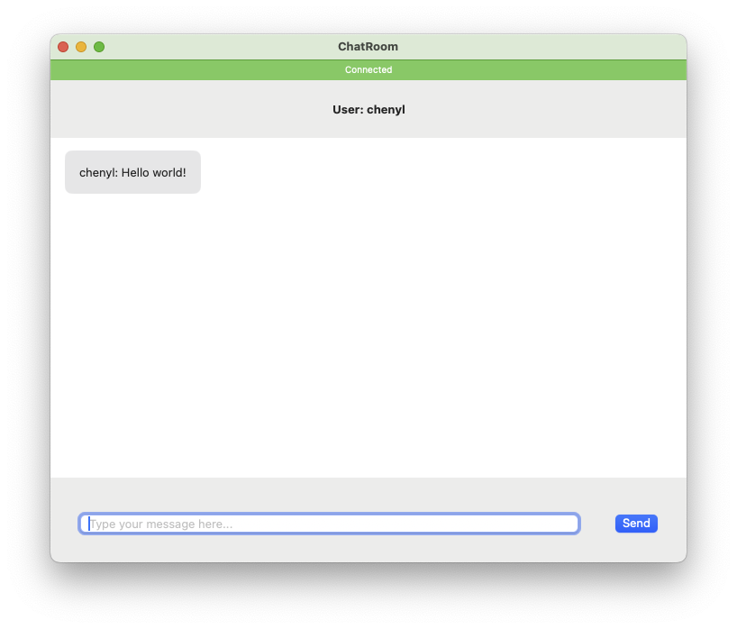

# ChatApp Sample with SignalR Swift Client

A simple chat application built using SwiftUI and SignalR for real-time messaging. This project demonstrates how to establish SignalR client with a SignalR server, send and receive messages.count

## Prerequests

- Swift >= 5.10
- macOS >= 11.0
- Dotnet >= 8 (Server needs dotnet)

## Run the sample

SignalR is a client-server protocol and currently server side only has dotnet library.

### Run the Server

```bash
cd Server
dotnet run
```

### Run the Client

Open ChatRoom.xcodeproj with XCode and run the project

You can see the app as the snapshot:



You can also open multiple clients and the message can be broadcasted to all clients.